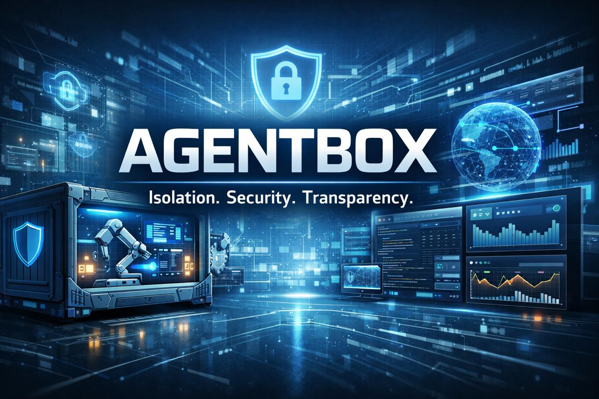

# 🔒 AgentBox

**Self-hosted AI agent runtime in a secure VM with encrypted secrets**

AgentBox is a security-first AI agent framework designed for isolated VM deployment on macOS and Linux. Run AI agents with complete host isolation, encrypted secrets storage, and enterprise-grade security controls.

> **Note:** AgentBox was inspired by and built upon the foundation of [OpenClaw](https://github.com/openclaw/openclaw), an open-source personal AI agent framework. We are grateful to the OpenClaw community for pioneering accessible self-hosted AI agents. AgentBox extends these concepts with enhanced security, encrypted secrets management, and VM isolation for enterprise and privacy-focused deployments.

## 🎯 Why AgentBox?

| Feature | AgentBox | Standard AI Tools | Cloud AI Services |
|---------|----------|-------------------|-------------------|
| **VM Isolation** | ✅ Built-in | ⚠️ Manual | ❌ N/A |
| **Encrypted Secrets** | ✅ age encryption | ⚠️ Plain .env | ⚠️ Provider KMS |
| **Zero Host Access** | ✅ Default | ❌ Full access | ❌ Cloud access |
| **Audit Logging** | ✅ Immutable logs | ⚠️ Limited | ⚠️ Limited |
| **Network Isolation** | ✅ Firewall rules | ⚠️ Manual | ❌ Internet required |
| **Snapshot/Rollback** | ✅ VM snapshots | ❌ N/A | ❌ N/A |
| **Air-gap Capable** | ✅ Optional | ❌ Internet required | ❌ Cloud only |
| **Self-Hosted** | ✅ Complete control | ⚠️ Varies | ❌ SaaS only |
| **Telemetry Dashboard** | ✅ Real-time observability | ❌ N/A | ⚠️ Limited |

## 📊 Telemetry & Observability

AgentBox includes a built-in **real-time observability dashboard** for monitoring your AI agent's performance, costs, and usage:

✅ **Real-time cost tracking** - Monitor API spending across all sessions and models  
✅ **Token usage analytics** - Track input/output tokens with cache optimization insights  
✅ **Tool usage patterns** - Identify bottlenecks and frequently used tools  
✅ **Timeline visualization** - See agent activity over time (hourly, daily, monthly)  
✅ **Session-level breakdowns** - Debug expensive runs and optimize workflows  

### Quick Start Telemetry

```bash
# Start AgentBox with telemetry dashboard
docker-compose up -d

# Access telemetry dashboard
open http://localhost:8501
```

The dashboard automatically discovers and monitors OpenClaw session logs. Perfect for:
- **Cost optimization** - Track spending and identify expensive operations
- **Performance tuning** - Analyze token usage and cache hit rates
- **Debugging** - Review session history and tool call patterns
- **Capacity planning** - Understand usage trends and forecast needs

See **[telemetry/README.md](telemetry/README.md)** for detailed setup and configuration.

## 🚀 Quick Start

### Prerequisites

- **Docker**: [Docker Desktop](https://www.docker.com/products/docker-desktop) or Docker Engine
- **macOS**: [UTM](https://mac.getutm.app/) or [VirtualBox](https://www.virtualbox.org/) (for full VM)
- **Linux**: [QEMU/KVM](https://www.qemu.org/) or [VirtualBox](https://www.virtualbox.org/) (for full VM)

### Option 1: Docker (Recommended)

#### Build the Image

```bash
# Clone the repo
git clone https://github.com/travis-burmaster/agentbox.git
cd agentbox

# Build the Docker image (takes 5-10 minutes)
docker build -t agentbox:latest .
```

#### Start the Container

```bash
# Start with Docker Compose (recommended)
docker-compose up -d

# Or with docker run
docker run -d --name agentbox \
  -v agentbox-config:/agentbox/.openclaw \
  -v agentbox-data:/agentbox/data \
  -v agentbox-logs:/agentbox/logs \
  -p 127.0.0.1:3000:3000 \
  agentbox:latest
```

#### Run Interactive Onboarding

To configure OpenClaw with API keys, models, and channels:

```bash
# Method 1: Using helper script (easiest)
./onboard.sh

# Method 2: Manual (connect to shell first, then run onboarding)
docker exec -it agentbox /bin/bash
# Inside container:
openclaw onboard --install-daemon
# Use arrow keys to navigate, Enter to confirm
# Press Ctrl+D or type 'exit' when done
```

**Note:** The `--install-daemon` flag is optional. It attempts to install systemd service (not available in Docker, but onboarding will complete successfully anyway).

#### Verify the Build

```bash
# Check OpenClaw version
docker exec agentbox openclaw --version
# Output: 2026.2.15

# View available commands
docker exec agentbox openclaw --help

# Run diagnostics
docker exec agentbox openclaw doctor

# Check gateway status
docker exec agentbox openclaw status
```

#### Using OpenClaw CLI Commands

Once the container is running, you can execute OpenClaw commands:

```bash
# Check system status
docker exec agentbox openclaw status

# List available models
docker exec agentbox openclaw models list

# View skills
docker exec agentbox openclaw skills list

# Check security settings
docker exec agentbox openclaw security audit

# Run diagnostics
docker exec agentbox openclaw doctor
```

#### Interactive Shell Access

For interactive commands (onboarding, configuration, etc.), connect to the container's bash shell:

```bash
# Connect to container shell
docker exec -it agentbox /bin/bash

# Inside container, you can run interactive commands:
openclaw onboard --install-daemon    # Full onboarding wizard
openclaw configure                   # Configuration wizard
openclaw agent chat "Hello!"         # Interactive AI chat

# Exit shell when done
exit
```

**Tip:** Use the `./onboard.sh` helper script for easier onboarding!

### Option 2: Vagrant (Full VM - Coming Soon)

```bash
# Clone and start VM
git clone https://github.com/travis-burmaster/agentbox.git
cd agentbox
vagrant up

# SSH into the VM
vagrant ssh

# Inside VM: Initialize OpenClaw
openclaw init
```

### Option 3: Manual VM Setup

See [VM_SETUP.md](./docs/VM_SETUP.md) for UTM, QEMU/KVM, and VirtualBox instructions.

---

## 📊 Current Status

### ✅ What Works

- **Docker Build**: Full OpenClaw compilation and installation
- **CLI Commands**: All `openclaw` CLI commands function correctly
- **Diagnostics**: `openclaw doctor`, `openclaw status`, `openclaw --help`
- **Model Management**: List and configure AI models
- **Skills**: View and manage agent skills
- **Security Tools**: Security auditing and configuration

### 🚧 In Progress

- **Gateway Service**: Requires configuration for daemon mode
  - CLI commands work fully ✅
  - Gateway daemon requires systemd (working on Docker-compatible solution)
  - Workaround: Use `openclaw configure` to set up, then run specific commands

- **Encrypted Secrets**: Template ready, needs integration testing
- **Network Isolation**: Firewall rules defined, needs runtime configuration
- **Vagrant VM**: Configuration files in progress

### 🎯 Quick Start Workflow

After building and starting the container:

1. **Connect to Container Shell**:
   ```bash
   docker exec -it agentbox /bin/bash
   ```

2. **Run Onboarding** (inside container):
   ```bash
   openclaw onboard --install-daemon
   ```
   - Use arrow keys to navigate prompts
   - Enter your Anthropic API key when prompted
   - Configure models, tools, and channels
   - Press Ctrl+D or type `exit` when complete

3. **Test AI Chat** (after exiting container):
   ```bash
   docker exec agentbox openclaw agent chat "Hello! Introduce yourself."
   ```

4. **Check Status**:
   ```bash
   docker exec agentbox openclaw status
   ```

**Alternative:** Use the helper script for automated onboarding:
```bash
./onboard.sh
```

---

## 🔐 Encrypted Secrets Management

AgentBox uses [age encryption](https://github.com/FiloSottile/age) to protect all secrets at rest.

### First-Time Setup

```bash
# Generate encryption key (do this ONCE, backup safely!)
age-keygen -o secrets/agent.key

# Your public key (safe to commit):
age1abc123...xyz789

# Add secrets
cat > secrets/secrets.env <<EOF
ANTHROPIC_API_KEY=sk-ant-...
OPENAI_API_KEY=sk-...
TELEGRAM_BOT_TOKEN=123456:ABC...
EOF

# Encrypt secrets
age -r age1abc123...xyz789 -o secrets/secrets.env.age secrets/secrets.env
rm secrets/secrets.env  # Delete plaintext!
```

### Using Encrypted Secrets

```bash
# Decrypt on-the-fly (never writes plaintext to disk)
age -d -i secrets/agent.key secrets/secrets.env.age | source /dev/stdin

# Or use the helper script
./scripts/load-secrets.sh
```

### Secrets File Structure

```bash
secrets/
├── agent.key              # Private key (NEVER commit! Add to .gitignore)
├── agent.key.pub          # Public key (safe to commit)
├── secrets.env.age        # Encrypted secrets (safe to commit)
└── README.md             # Instructions
```

**✅ Safe to commit:** `*.age`, `*.pub`  
**❌ NEVER commit:** `agent.key`, `*.env` (plaintext)

## 🛡️ Security Features

### 1. VM Isolation
- Agent runs in completely isolated VM
- No direct host filesystem access
- Restricted network egress (allowlist-only)
- Dedicated virtual network interface

### 2. Encrypted Secrets
- All secrets encrypted with age (ChaCha20-Poly1305)
- Private keys stored in VM only
- Secrets decrypted in-memory (never written to disk)
- Automatic key rotation scripts included

### 3. Network Security
- Default-deny firewall (UFW/iptables)
- Allowlist for API endpoints (Anthropic, OpenAI, etc.)
- Optional Tor/VPN routing
- DNS-over-HTTPS (DoH) enabled

### 4. Audit Logging
- All agent actions logged to immutable append-only log
- Logs exported to host via read-only mount
- Syslog integration for centralized monitoring
- Tamper-evident log signatures

### 5. Hardening
- SELinux/AppArmor profiles included
- Automatic security updates (unattended-upgrades)
- Minimal attack surface (no GUI, minimal packages)
- Secure boot support

## 📦 What's Included

```
agentbox/
├── Dockerfile              # ✅ Docker container config (working)
├── docker-entrypoint.sh    # ✅ Container startup script with secrets loading
├── agentfork/              # ✅ Core OpenClaw framework (built from source)
│   ├── src/               # OpenClaw source code
│   ├── dist/              # Compiled JavaScript
│   ├── package.json       # Node.js dependencies
│   └── openclaw.mjs       # CLI entry point
├── scripts/
│   └── (coming soon)      # Helper scripts for secrets, backup, hardening
├── secrets/
│   └── (template)         # Encrypted secrets management templates
├── security/
│   └── (coming soon)      # Firewall rules, SELinux, AppArmor profiles
├── vm-configs/            # (coming soon)
│   ├── utm/              # macOS UTM configs
│   ├── qemu/             # Linux QEMU/KVM configs
│   └── virtualbox/       # Cross-platform VirtualBox
└── docs/
    ├── SECURITY.md        # Security architecture documentation
    └── (expanding)        # More guides coming
```

### What Actually Runs

The Docker image includes:
- **Ubuntu 22.04** base system
- **Node.js 22.x** runtime
- **OpenClaw 2026.2.15** fully compiled and installed
- **System tools**: curl, wget, git, build-essential
- **Security tools**: age encryption, ufw firewall, fail2ban, auditd
- **Python 3** with pip for extensions

### Image Size

- **Compressed**: ~1.5 GB
- **Uncompressed**: ~4.4 GB
- **Build time**: 5-10 minutes (with caching)

## 🔧 Configuration

### Agent Configuration

```yaml
# agentbox.yaml
agent:
  name: "AgentBox"
  model: "anthropic/claude-sonnet-4-5"
  
secrets:
  encryption: "age"
  key_path: "/agentbox/secrets/agent.key"
  secrets_path: "/agentbox/secrets/secrets.env.age"

network:
  mode: "restricted"  # restricted | allowlist | open
  allowed_domains:
    - "api.anthropic.com"
    - "api.openai.com"
    - "api.telegram.org"
  
security:
  firewall: true
  selinux: true
  audit_logging: true
  auto_updates: true

vm:
  memory: "4GB"
  cpus: 2
  disk: "20GB"
  snapshot_on_shutdown: true
```

## 🎓 Use Cases

### 1. Personal AI Assistant (Privacy-Focused)
- All data stays on your hardware
- Encrypted secrets for API keys
- No telemetry or cloud dependencies

### 2. Development/Testing
- Isolated environment for agent experiments
- Snapshot before risky operations
- Rollback on failure

### 3. Enterprise Deployment
- Compliance-friendly (HIPAA, PCI, SOC 2)
- Air-gap capable for sensitive environments
- Audit logs for security reviews

### 4. Research
- Controlled environment for AI safety research
- Reproducible experiments (VM snapshots)
- Network isolation for adversarial testing

## 📋 Roadmap

### v0.1.0 - Foundation (Current)

- [x] **Docker Build System**
  - [x] OpenClaw compilation from source
  - [x] Node.js 22.x integration
  - [x] Multi-stage build optimization
  - [x] Working CLI commands

- [x] **Core Components**
  - [x] OpenClaw 2026.2.15 fully functional
  - [x] age encryption tools installed
  - [x] Security tools (ufw, fail2ban, auditd)
  - [x] Python 3 runtime

- [ ] **Secrets Management** (Template Ready)
  - [x] age encryption support
  - [ ] Automated secrets loading in entrypoint
  - [ ] Key rotation scripts
  - [ ] Backup automation

- [ ] **Gateway Service**
  - [x] CLI commands working
  - [ ] Docker-compatible daemon mode (no systemd dependency)
  - [ ] Configuration wizard
  - [ ] Persistent storage configuration

### v0.2.0 - VM Deployment

- [ ] **Vagrant Integration**
  - [ ] Vagrantfile for automated VM provisioning
  - [ ] Multi-provider support (VirtualBox, VMware, Parallels)
  - [ ] Shared folder configuration

- [ ] **Manual VM Configs**
  - [ ] UTM (macOS) configuration files
  - [ ] QEMU/KVM (Linux) setup scripts  
  - [ ] VirtualBox OVA exports

- [ ] **Network Isolation**
  - [ ] UFW firewall rules
  - [ ] API endpoint allowlists
  - [ ] DNS-over-HTTPS configuration
  - [ ] Optional Tor/VPN routing

### v0.3.0 - Enhanced Security

- [ ] **Mandatory Access Control**
  - [ ] SELinux policies
  - [ ] AppArmor profiles
  - [ ] Seccomp filters

- [ ] **Audit & Monitoring**
  - [ ] Immutable append-only logging
  - [ ] Syslog integration
  - [ ] Tamper-evident log signatures
  - [ ] Security event alerting

- [ ] **Advanced Secrets**
  - [ ] Hardware security module (HSM) support
  - [ ] PKCS#11 integration
  - [ ] Automatic key rotation
  - [ ] Multi-key encryption (threshold)

### v0.4.0 - Compliance & Enterprise

- [ ] **Compliance Frameworks**
  - [ ] FIPS 140-2 mode
  - [ ] STIG hardening
  - [ ] Compliance reporting (HIPAA, PCI, SOC 2)
  - [ ] CIS Benchmark alignment

- [ ] **Enterprise Features**
  - [ ] Multi-tenancy support
  - [ ] Centralized logging (SIEM integration)
  - [ ] Role-based access control (RBAC)
  - [ ] Zero-knowledge backup

### Future Considerations

- [ ] Kubernetes deployment (Helm charts)
- [ ] ARM64 support (Apple Silicon, Raspberry Pi)
- [ ] WebAssembly sandbox for untrusted code
- [ ] Hardware root of trust (TPM, Secure Enclave)

## 🤝 Contributing

Security contributions are welcome! Please see [CONTRIBUTING.md](./CONTRIBUTING.md).

**Security vulnerabilities:** Report privately via GitHub Security Advisories.

## 📜 License

AgentBox is released under the **MIT License**.

## 🙏 Acknowledgments

AgentBox was inspired by and builds upon [OpenClaw](https://github.com/openclaw/openclaw), an open-source framework for self-hosted AI agents. We extend our gratitude to the OpenClaw team and community for their pioneering work in making AI agents accessible and self-hostable.

**Other Credits:**
- **age** - Modern encryption tool by Filippo Valsorda
- **Vagrant** - HashiCorp's VM automation tool
- **Docker** - Container platform

## 🔍 Troubleshooting

### Docker Build Issues

**Problem**: Build fails with "could not resolve module" errors

**Solution**: Ensure you have the latest OpenClaw source files:
```bash
# The repository includes all necessary source files
# If you encounter missing modules, try a clean build:
docker build --no-cache -t agentbox:latest .
```

**Problem**: Build takes too long or runs out of memory

**Solution**: Increase Docker resources:
- **Docker Desktop**: Settings → Resources → Memory (increase to 8GB+)
- **Linux**: Check `docker info` for available resources

### Runtime Issues

**Problem**: `openclaw` command not found in container

**Solution**: The container uses the binary name `openclaw` (not `agentbox`):
```bash
# Correct:
docker run --rm agentbox:latest openclaw --version

# Incorrect:
docker run --rm agentbox:latest agentbox --version
```

**Problem**: Gateway fails to start with systemd error

**Solution**: This is expected. Gateway daemon mode requires configuration. Use CLI commands directly:
```bash
# Instead of running the gateway daemon:
docker run --rm agentbox:latest openclaw status
docker run --rm agentbox:latest openclaw models list
docker run --rm agentbox:latest openclaw skills list
```

**Problem**: Container exits immediately

**Solution**: The default CMD tries to start the gateway service. Override it:
```bash
# Run a specific command:
docker run --rm agentbox:latest openclaw doctor

# Open a shell:
docker run -it --rm agentbox:latest /bin/bash
```

### Common Commands Reference

```bash
# Version check
docker run --rm agentbox:latest openclaw --version

# System diagnostics
docker run --rm agentbox:latest openclaw doctor

# Configuration wizard (interactive)
docker run -it agentbox:latest openclaw configure

# List available models
docker run --rm agentbox:latest openclaw models list

# List installed skills
docker run --rm agentbox:latest openclaw skills list

# Security audit
docker run --rm agentbox:latest openclaw security audit

# Help for any command
docker run --rm agentbox:latest openclaw <command> --help
```

---

## 📞 Support

- **Documentation:** [docs/](./docs/)
- **Issues:** [GitHub Issues](https://github.com/travis-burmaster/agentbox/issues)
- **Discussions:** [GitHub Discussions](https://github.com/travis-burmaster/agentbox/discussions)
- **OpenClaw Docs:** [https://docs.openclaw.ai](https://docs.openclaw.ai)

---

## ⚠️ Important Notices

**Alpha Software:** AgentBox is in early development. The Docker CLI interface is fully functional, but gateway daemon mode requires additional configuration. Use in production at your own risk. Always test in a safe environment first.

**Security Notice:** Encryption is only as strong as your key management. Keep your `agent.key` safe, backed up, and never commit it to version control.

**OpenClaw Integration:** This project uses OpenClaw as its core framework. The command-line tool is `openclaw`, not `agentbox`. AgentBox adds security, VM isolation, and encrypted secrets management on top of OpenClaw's foundation.
